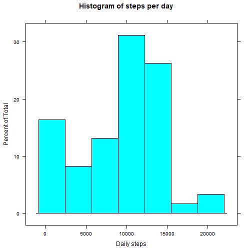
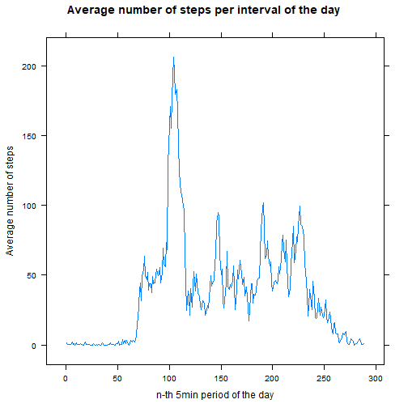
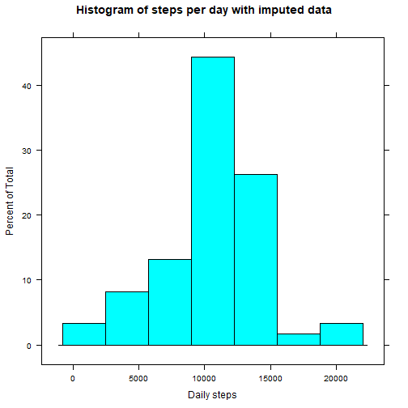
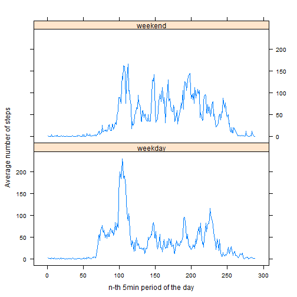

```r
library(lattice)
```

## Loading and preprocessing the data

```r
activity <- read.csv('activity.csv')
activity$date <- as.Date(activity$date, format='%Y-%m-%d')
activity$interval <- as.factor(activity$interval)
```

## What is mean total number of steps taken per day?

### Make a histogram of the total number of steps taken each day

```r
steps_per_day <- tapply(activity$steps, activity$date, sum, na.rm=TRUE)
histogram(steps_per_day, xlab="Daily steps", main ="Histogram of steps per day")
```



### Calculate and report the mean and median total number of steps taken per day

```r
mean_steps_per_day <- round(mean(steps_per_day))
median_steps_per_day <- round(median(steps_per_day))
```
The mean daily steps is 9354 and the median is 1.0395 &times; 10<sup>4</sup>.

## What is the average daily activity pattern?

### Make a time series plot (i.e. type = "l") of the 5-minute interval (x-axis) and the average number of steps taken, averaged across all days (y-axis)

```r
mean_steps_per_interval <- tapply(activity$steps, activity$interval, mean, na.rm=TRUE)
xyplot(mean_steps_per_interval ~ as.numeric(activity$interval), type='l',
       xlab='n-th 5min period of the day',
       ylab='Average number of steps',
       main="Average number of steps per interval of the day")
```



### Which 5-minute interval, on average across all the days in the dataset, contains the maximum number of steps?

```r
max_interval_index <- which.max(mean_steps_per_interval)
```
104-th 5min interval contains the max number of steps on average across the day.

## Imputing missing values

### Calculate and report the total number of missing values in the dataset (i.e. the total number of rows with NAs)

```r
num_missing_vals <- sum(is.na(activity$steps))
```
Total number of missing values is 2304.

### Replace missing data with average number of steps taken for that 5-minute interval

```r
activity_imp <- activity
for(i in 1:length(activity_imp$steps)) {
    if(is.na(activity_imp$steps[i])) {
        activity_imp$steps[i] <- mean_steps_per_interval[as.numeric(activity_imp$interval[i])]
    }
}
```

### Make a histogram of the total number of steps taken each day with imputed data

```r
steps_per_day_imp <- tapply(activity_imp$steps, activity_imp$date, sum, na.rm=TRUE)
histogram(steps_per_day_imp, xlab="Daily steps", main ="Histogram of steps per day with imputed data")
```



### Calculate and report the mean and median total number of steps taken per day with imputed data

```r
mean_steps_per_day_imp <- round(mean(steps_per_day_imp))
median_steps_per_day_imp <- round(median(steps_per_day_imp))
```
Using imputed data, the mean daily steps is 1.0766 &times; 10<sup>4</sup> and the median is 1.0766 &times; 10<sup>4</sup>. <br>
Due to the method used to impute data, a number of days with missing data is replaced with the typical day of activity. Meaning the number of 0 steps days decreased, while the number of "typical" days increased.

## Are there differences in activity patterns between weekdays and weekends?

### Adding "weekday" and "weekend" factors

```r
days <- weekdays(activity_imp$date)
days[days=="Sunday" | days == "Saturday"] <- "weekend"
days[days!="weekend"] <- "weekday"
activity_imp <- cbind(activity_imp, as.factor(days))
```

Calculate and plot the means for each interval for weekday and weekend.

```r
int_mean_by_day <- with(activity_imp, aggregate(steps, list(interval, days), FUN=mean))
colnames(int_mean_by_day) <- c("interval","days","steps")

xyplot(int_mean_by_day$steps ~ as.numeric(int_mean_by_day$interval) | int_mean_by_day$days, 
       type='l', 
       xlab='n-th 5min period of the day',
       ylab='Average number of steps',
       layout=c(1,2))
```


<br>
The plot shows the user was more active during the weekend, judging by the fact that there are more frequent spikes of steps over 100. 


